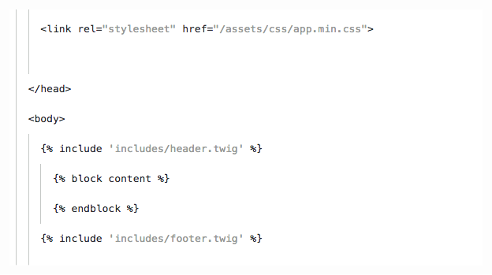

# Neat theme for Visual Studio Code 
Neat is a light monochrome theme based on Apex Syntax for Atom. Most of the code will be rendered dark with strings and numbers lightened to stand out.

## Screenshots

