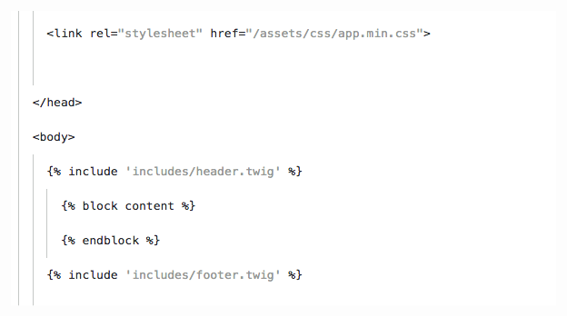
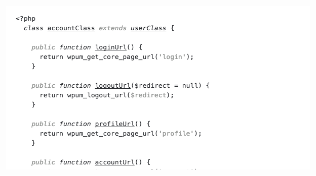

# Neat theme for Visual Studio Code 
Neat is a light monochrome theme based on Apex Syntax for Atom. It is designed to provide a focused writing experience for both Markdown and code, using minimal highlighting to avoid distraction.

## Screenshots

